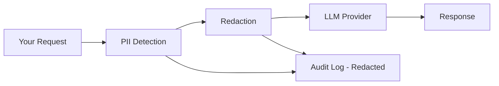

Aptly automatically detects and redacts Personally Identifiable Information (PII) from your requests before sending them to LLM providers. This guide explains how PII redaction works, the different modes available, and best practices.

## How It Works

Every request to `/v1/chat/completions` goes through PII detection and redaction:

1. **Detection**: Aptly scans your input messages using Microsoft Presidio
2. **Redaction**: PII is replaced according to your configured mode
3. **LLM Call**: The redacted messages are sent to the LLM provider
4. **Audit Log**: Both original and redacted messages are stored separately
5. **Response**: Optionally, the LLM's response can be scanned for PII



## Supported PII Types

Aptly detects the following types of PII:

| Entity Type | Description | Example |
|-------------|-------------|---------|
| `PERSON` | Person names | "John Smith", "Dr. Jane Doe" |
| `EMAIL_ADDRESS` | Email addresses | "john@example.com" |
| `PHONE_NUMBER` | Phone numbers | "+1-555-0100", "(555) 123-4567" |
| `US_SSN` | Social Security Numbers | "123-45-6789" |
| `CREDIT_CARD` | Credit card numbers | "4111-1111-1111-1111" |
| `IBAN_CODE` | Bank account numbers | "GB29 NWBK 6016 1331 9268 19" |
| `MEDICAL_LICENSE` | Medical license numbers | "A123456" |
| `US_PASSPORT` | Passport numbers | "123456789" |
| `LOCATION` | Addresses, cities | "123 Main St", "New York" |
| `DATE_TIME` | Dates and times | "January 1, 2026", "10:30 AM" |
| `IP_ADDRESS` | IP addresses | "192.168.1.1" |
| `URL` | Web URLs | "https://example.com" |

<Note>
  Detection is powered by Microsoft Presidio with spaCy NLP models, achieving high accuracy with low false positives.
</Note>

## Redaction Modes

Aptly supports three redaction modes. Choose the one that best fits your use case.

### mask (Default)

Replaces PII with labeled tokens like `PERSON_A`, `EMAIL_A`, etc.

**Example:**
```
Input:  "My name is John Smith and my email is john@example.com"
Output: "My name is PERSON_A and my email is EMAIL_A"
```

**Characteristics:**
- ✅ Preserves sentence structure and context
- ✅ LLM understands there's a person and email
- ✅ Consistent labeling (same entity → same token)
- ✅ Multiple entities of same type are labeled A, B, C, etc.

**Best for:**
- General use cases
- When context matters for LLM responses
- Applications where the LLM needs to reference the person/email

**Example with multiple entities:**
```
Input:  "Contact John Smith at john@email.com or Jane Doe at jane@email.com"
Output: "Contact PERSON_A at EMAIL_A or PERSON_B at EMAIL_B"
```

### hash

Replaces PII with consistent cryptographic hashes.

**Example:**
```
Input:  "My name is John Smith and my email is john@example.com"
Output: "My name is HASH_a3f2c1b9 and my email is HASH_def45678"
```

**Characteristics:**
- ✅ Same PII always produces same hash (consistent)
- ✅ Trackable across multiple requests
- ✅ More obfuscated than mask mode
- ✅ One-way transformation (cannot reverse)

**Best for:**
- Tracking the same entity across requests
- When you need consistency but want more privacy than mask
- Analytics and pattern detection

**Consistency example:**
```
Request 1: "John Smith called"     → "HASH_a3f2c1b9 called"
Request 2: "Email John Smith"      → "Email HASH_a3f2c1b9"
Request 3: "John Smith is here"    → "HASH_a3f2c1b9 is here"
```

### remove

Completely removes PII and replaces with `[REDACTED]`.

**Example:**
```
Input:  "My name is John Smith and my email is john@example.com"
Output: "My name is [REDACTED] and my email is [REDACTED]"
```

**Characteristics:**
- ✅ Maximum privacy protection
- ✅ Simplest approach
- ✅ No PII information preserved
- ❌ Loses all context
- ❌ May affect LLM response quality

**Best for:**
- Maximum privacy requirements
- When PII context is not needed
- Highly sensitive applications

**When to avoid:**
- If the LLM needs to reference the person/email in its response
- If preserving conversational context is important

## Changing Redaction Mode

Update your PII redaction mode via the API:

<CodeGroup>

```python Python
import requests

response = requests.patch(
    "https://api-aptly.nsquaredlabs.com/v1/me",
    headers={
        "Authorization": "Bearer apt_live_xyz789",
        "Content-Type": "application/json"
    },
    json={
        "pii_redaction_mode": "hash"  # or "mask", "remove"
    }
)

updated = response.json()
print(f"PII mode updated to: {updated['pii_redaction_mode']}")
```

```bash cURL
curl -X PATCH "https://api-aptly.nsquaredlabs.com/v1/me" \
  -H "Authorization: Bearer apt_live_xyz789" \
  -H "Content-Type: application/json" \
  -d '{"pii_redaction_mode": "hash"}'
```

</CodeGroup>

See [Update Settings](/api/customer/update-settings) for details.

## Response PII Detection

By default, Aptly only redacts PII in your **input** messages. The LLM's response is not scanned for PII.

To enable response PII detection, set `redact_response: true` in your chat completion request:

```python
response = requests.post(
    "https://api-aptly.nsquaredlabs.com/v1/chat/completions",
    headers={"Authorization": "Bearer apt_live_xyz789"},
    json={
        "model": "gpt-4",
        "messages": [
            {"role": "user", "content": "What's my name? It's John Smith."}
        ],
        "api_keys": {"openai": "sk-..."},
        "redact_response": True  # Enable response PII detection
    }
)
```

**When enabled:**
- The LLM's response is scanned for PII
- Detected PII is logged in the audit log
- The response is NOT automatically redacted (logged for compliance only)
- You can review detected response PII in audit logs

**Use response detection when:**
- You need to audit if LLMs are generating PII
- Compliance requires tracking PII in responses
- You want to monitor for data leakage

## Real-World Examples

### Healthcare Application

```python
# Patient inquiry
request = {
    "model": "gpt-4",
    "messages": [
        {
            "role": "user",
            "content": "Patient John Smith (SSN: 123-45-6789) needs prescription refill"
        }
    ],
    "api_keys": {"openai": "sk-..."}
}

# What the LLM receives (mask mode):
# "Patient PERSON_A (SSN: US_SSN_A) needs prescription refill"

# LLM can still provide relevant medical advice without seeing actual PII
```

### Customer Support

```python
# Support ticket
request = {
    "model": "gpt-4",
    "messages": [
        {
            "role": "user",
            "content": "Customer jane.doe@email.com called from +1-555-0100 about order #12345"
        }
    ],
    "api_keys": {"openai": "sk-..."}
}

# Redacted (mask mode):
# "Customer EMAIL_A called from PHONE_NUMBER_A about order #12345"

# LLM can help with order #12345 without accessing customer's contact info
```

### Financial Application

```python
# Using hash mode for consistency
request = {
    "model": "gpt-4",
    "messages": [
        {
            "role": "user",
            "content": "Check transactions for card 4111-1111-1111-1111"
        }
    ],
    "api_keys": {"openai": "sk-..."}
}

# Redacted (hash mode):
# "Check transactions for card HASH_a3f2c1b9"

# Same card number will always be HASH_a3f2c1b9 across all requests
```

## Viewing Redacted Messages

Check what was redacted in the audit logs:

```python
import requests

# Get a specific log
response = requests.get(
    "https://api-aptly.nsquaredlabs.com/v1/logs/log_abc123",
    headers={"Authorization": "Bearer apt_live_xyz789"}
)

log = response.json()

# Compare original vs redacted
print("Original:", log['messages_original'][0]['content'])
print("Redacted:", log['messages_redacted'][0]['content'])

# See what PII was detected
for entity in log['pii_entities_input']:
    print(f"Detected {entity['entity_type']} with {entity['score']:.0%} confidence")
```

See [Get Log Detail](/api/audit-logs/get-log) for more details.

## Detection Accuracy

Presidio uses NLP models with confidence scores:

- **High confidence (>0.85)**: Very likely PII - automatically redacted
- **Medium confidence (0.50-0.85)**: Probably PII - redacted
- **Low confidence (<0.50)**: Unlikely PII - not redacted

You can review confidence scores in audit logs to tune your expectations.

## Best Practices

### 1. Choose the Right Mode

- **Start with `mask`** - Works well for most use cases
- **Use `hash`** when you need to track entities across requests
- **Use `remove`** only when maximum privacy is required

### 2. Test Your Use Case

Before going to production, test how each mode affects your LLM responses:

```python
# Test all three modes
modes = ["mask", "hash", "remove"]
test_message = "Contact John Smith at john@example.com about the meeting"

for mode in modes:
    # Update mode
    requests.patch(
        "https://api-aptly.nsquaredlabs.com/v1/me",
        headers={"Authorization": "Bearer apt_live_xyz789"},
        json={"pii_redaction_mode": mode}
    )

    # Test request
    response = requests.post(
        "https://api-aptly.nsquaredlabs.com/v1/chat/completions",
        headers={"Authorization": "Bearer apt_live_xyz789"},
        json={
            "model": "gpt-4",
            "messages": [{"role": "user", "content": test_message}],
            "api_keys": {"openai": "sk-..."}
        }
    )

    print(f"\nMode: {mode}")
    print(f"Response: {response.json()['choices'][0]['message']['content']}")
```

### 3. Enable Response Detection for Sensitive Apps

If you're handling HIPAA, financial, or other sensitive data, enable response PII detection to audit what LLMs generate.

### 4. Regular Audits

Periodically review your audit logs to:
- Verify PII is being detected correctly
- Check for false positives/negatives
- Ensure compliance requirements are met

```python
# Check recent logs for PII detection
response = requests.get(
    "https://api-aptly.nsquaredlabs.com/v1/logs",
    headers={"Authorization": "Bearer apt_live_xyz789"},
    params={"limit": 100}
)

logs = response.json()['logs']
pii_detected = sum(1 for log in logs if log['pii_detected_input'])

print(f"PII detected in {pii_detected}/{len(logs)} requests ({pii_detected/len(logs)*100:.1f}%)")
```

### 5. Document Your Mode Choice

Document why you chose a specific mode for compliance audits:

```python
# Example: Healthcare application
# PII Mode: mask
# Reason: HIPAA compliance requires PII protection while maintaining
#         clinical context for accurate medical advice
# Date: 2026-01-31
# Approved by: Compliance Team
```

## Limitations

### What PII Detection Cannot Do

<Warning>
  PII detection is not perfect. It may:

  - Miss novel PII formats
  - Generate false positives (flag non-PII as PII)
  - Struggle with heavily abbreviated or encoded text
  - Not detect domain-specific identifiers
</Warning>

### Language Support

Currently supports **English only**. Other languages may have reduced accuracy.

### Context-Dependent PII

Some information is PII in one context but not another:
- "John" alone may not be detected
- "Dr. John Smith" is more likely to be detected
- Common names might need additional context

### Custom PII Types

If you have domain-specific PII (e.g., employee IDs, custom identifiers), contact your admin about extending detection rules.

## Troubleshooting

### PII Not Being Detected

If PII isn't being detected:

1. **Check the format** - Unusual formats may not be recognized
2. **Review confidence scores** - Low-confidence detections aren't redacted
3. **Check supported types** - Some PII types aren't in the standard list
4. **Add context** - "John Smith" is easier to detect than just "John"

### False Positives

If non-PII is being redacted:

1. **Review audit logs** - Check confidence scores
2. **Rephrase input** - Use less ambiguous language
3. **Accept some false positives** - Better safe than sorry for compliance

### LLM Response Quality Issues

If redaction hurts response quality:

- **Try `mask` mode** instead of `remove` - preserves more context
- **Use `hash` mode** for consistency
- **Adjust your prompts** - Provide context without PII

## Related Documentation

- [Chat Completions API](/api/chat-completions) - How to use PII redaction
- [Update Settings](/api/customer/update-settings) - Change redaction mode
- [Audit Logs](/api/audit-logs/query-logs) - Review what was redacted
- [Compliance Guide](/guides/compliance) - HIPAA, SOC2, GDPR requirements
