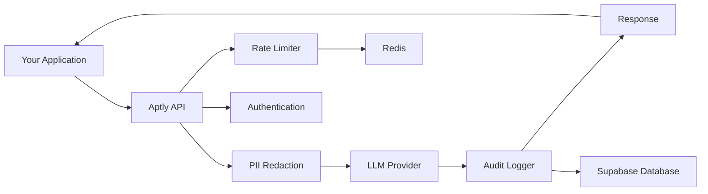
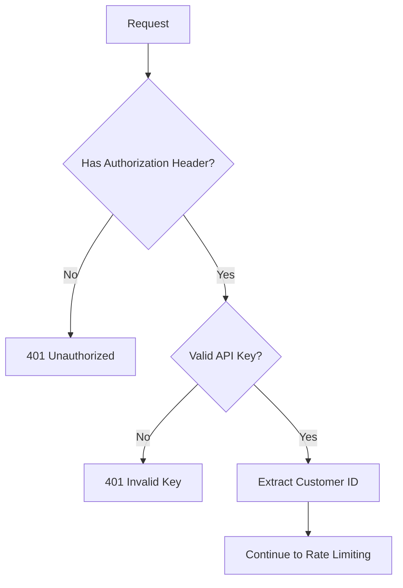
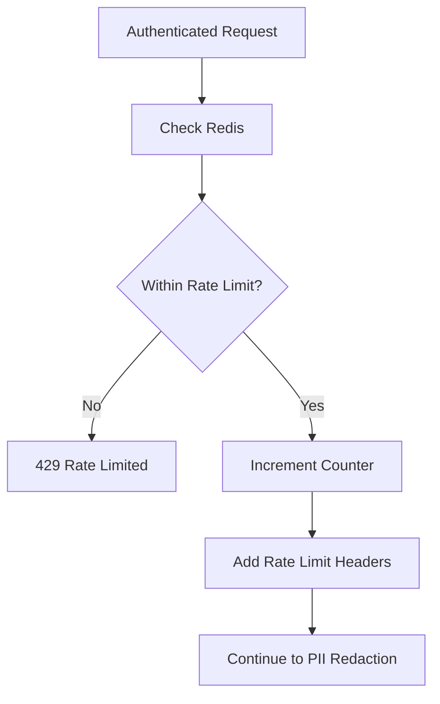
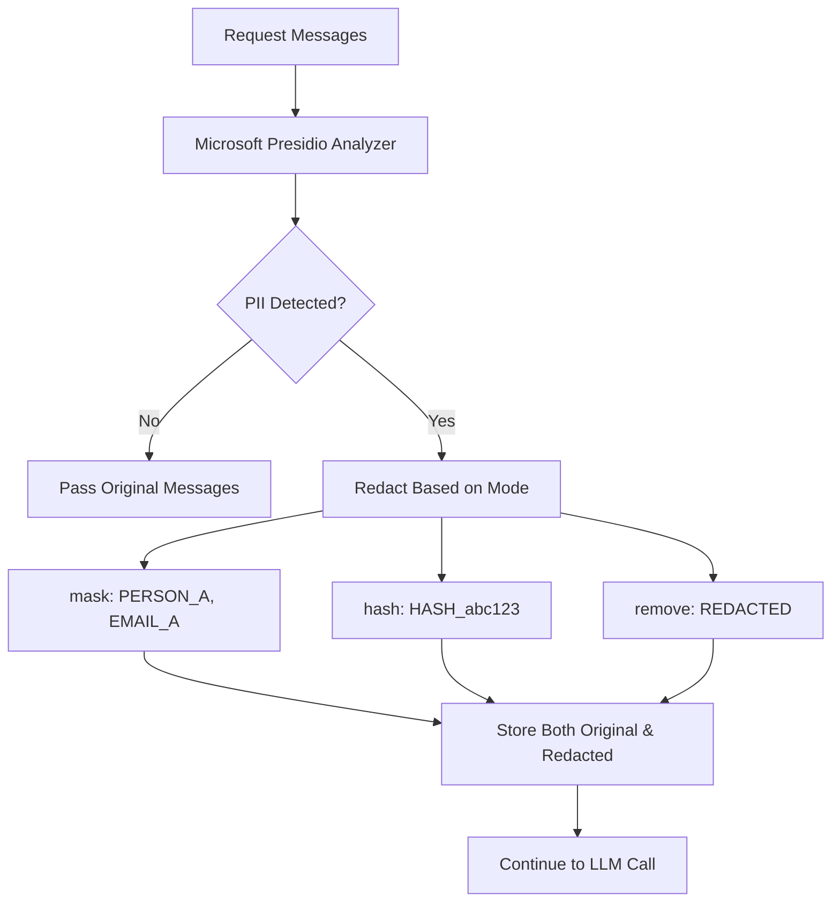
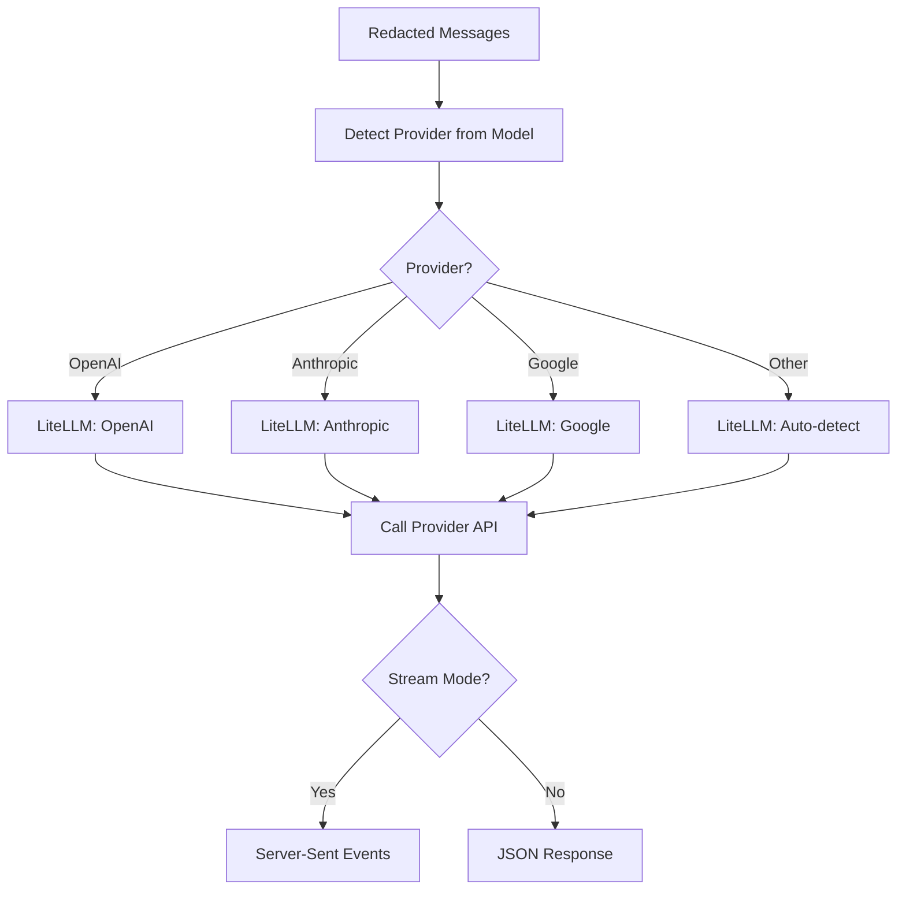
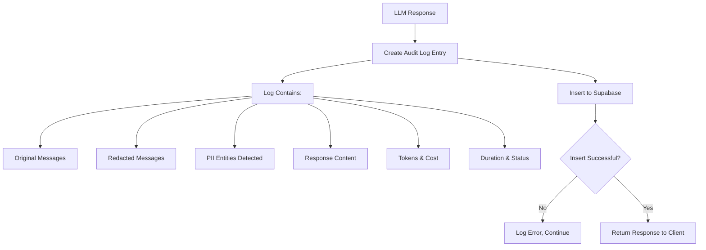
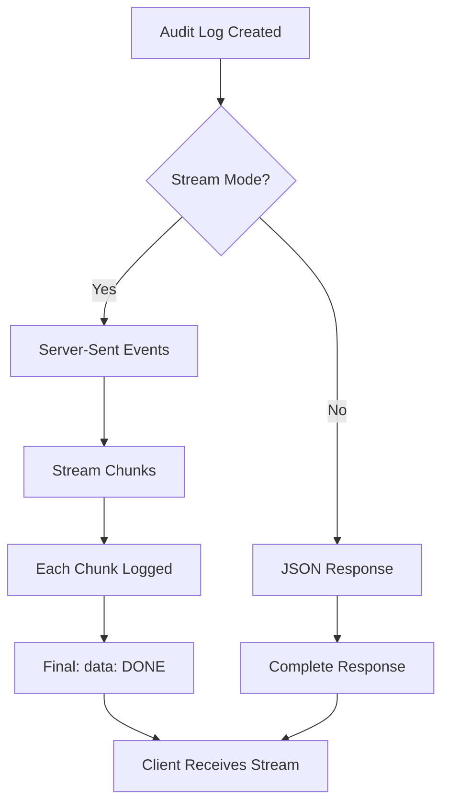

# Architecture

Aptly's system architecture, components, and data flow

<Info>
This architecture guide is useful for understanding how Aptly works internally, but you don't need to know these details to **use** Aptly as a customer. If you're just getting started, check out the [Quickstart Guide](/quickstart) instead.

**This guide is for:**
- Developers integrating Aptly who want to understand the internals
- Enterprise customers evaluating Aptly's security model
- Contributors and the Aptly team
</Info>

# System Architecture

Aptly is a compliance-as-a-service middleware API that sits between your application and LLM providers. This guide explains the system architecture, core components, and how data flows through the system.

## System Overview



**Architecture Principles:**
- **Stateless API** - No session state, scales horizontally
- **Fail-open** - If Redis is down, requests proceed (logged warning)
- **Immutable logs** - Audit logs cannot be modified or deleted
- **Customer-provided keys** - LLM API keys never stored by Aptly

## Request Flow

Every request to `/v1/chat/completions` follows this path:

### 1. Authentication



**Authentication Details:**
- API keys are hashed using SHA-256
- Only hash is stored in database (never raw key)
- Customer ID is extracted from the validated key
- Two auth paths:
  - **Admin Secret** (`X-Admin-Secret` header) - For creating customers only
  - **API Keys** (`Authorization: Bearer apt_live_*`) - For all customer operations

**Source:** `src/auth.py`

### 2. Rate Limiting



**Rate Limiting Details:**
- Distributed via Redis (supports multiple workers)
- Per-customer rate limits (default: 1000 req/hour)
- Hourly reset (e.g., 10:00, 11:00, 12:00 UTC)
- Headers returned: `X-RateLimit-Limit`, `X-RateLimit-Remaining`, `X-RateLimit-Reset`
- **Fail-open**: If Redis is unavailable, allow request and log warning

**Source:** `src/rate_limiter.py`

### 3. PII Redaction



**PII Redaction Details:**
- Powered by Microsoft Presidio
- NLP model: spaCy `en_core_web_sm`
- Detects 15+ PII types (PERSON, EMAIL, SSN, CREDIT_CARD, etc.)
- Three modes:
  - `mask`: "John Smith" → "PERSON_A" (preserves context)
  - `hash`: "John Smith" → "HASH_a3f2c1b9" (consistent)
  - `remove`: "John Smith" → "[REDACTED]" (maximum privacy)
- Original messages stored separately for audit
- Redacted messages sent to LLM provider

**Source:** `src/compliance/pii_redactor.py`

### 4. LLM Provider Call



**LLM Router Details:**
- Abstraction layer using LiteLLM
- Supports multiple providers:
  - OpenAI (gpt-4, gpt-3.5-turbo)
  - Anthropic (claude-3.5-sonnet, claude-3-opus)
  - Google (gemini-1.5-pro, gemini-1.5-flash)
  - Cohere, Together AI, and others
- Provider auto-detection from model name
- Customer-provided API keys (passed per-request, never stored)
- Streaming support via SSE (Server-Sent Events)

**Source:** `src/llm_router.py`

### 5. Audit Logging



**Audit Logging Details:**
- Every request logged (success or failure)
- Immutable by design (database trigger prevents modification/deletion)
- Stored data:
  - Timestamp and customer ID
  - Original messages (with PII)
  - Redacted messages (sent to LLM)
  - PII entities detected (type, location, confidence)
  - Response content
  - Tokens used (input/output)
  - Cost estimate (USD)
  - Duration and status
  - Compliance framework (if set)
- Retention: 2555 days (~7 years) by default
- Never blocks response (logged asynchronously)

**Source:** `src/compliance/audit_logger.py`

### 6. Response



## Core Components

### FastAPI Application

**File:** `src/main.py`

The main application entry point. Defines all API routes and handles request/response lifecycle.

**Key Features:**
- OpenAPI documentation (auto-generated)
- Sentry error tracking (if configured)
- Structured logging with structlog
- Health check endpoint (`/v1/health`)
- Lifespan manager for cleanup

**Environment:** Production uses Uvicorn with multiple workers

### Supabase Client

**File:** `src/supabase_client.py`

Database client for Postgres via Supabase.

**Key Features:**
- Uses service role key (bypasses Row Level Security)
- Direct client queries (no ORM)
- Three tables:
  - `customers` - Customer accounts and settings
  - `api_keys` - Hashed API keys with rate limits
  - `audit_logs` - Immutable request logs

**Why Supabase over SQLAlchemy?**
- Simpler, less boilerplate
- Built-in features (RLS, real-time, auth)
- Easier to extend

### PII Redactor

**File:** `src/compliance/pii_redactor.py`

Microsoft Presidio integration for PII detection and redaction.

**Key Features:**
- Analyzer: Detects PII using NLP
- Anonymizer: Redacts based on mode (mask/hash/remove)
- Supports 15+ entity types
- Confidence-based detection (threshold: 0.5)
- English language only

**Presidio Architecture:**
```
Input Text → Analyzer (NLP) → Entities Detected → Anonymizer → Redacted Text
```

### Audit Logger

**File:** `src/compliance/audit_logger.py`

Immutable audit log writer for compliance.

**Key Features:**
- Logs every request (success/error)
- Stores original + redacted messages separately
- PII entities with confidence scores
- Token usage and cost tracking
- Database trigger prevents modification

### Rate Limiter

**File:** `src/rate_limiter.py`

Redis-based distributed rate limiting.

**Key Features:**
- Per-customer limits
- Hourly sliding window
- Fail-open design (continues if Redis is down)
- Rate limit headers in every response

**Redis Key Format:**
```
rate_limit:{customer_id}:{hour_bucket}
```

### LLM Router

**File:** `src/llm_router.py`

LiteLLM abstraction for multi-provider support.

**Key Features:**
- Auto-detect provider from model name
- Streaming support (SSE)
- Error handling and retries
- Cost estimation
- No key storage (customer-provided)

## Data Storage

### Supabase (Postgres)

**Primary database** for all persistent data.

**Tables:**

| Table | Purpose | Immutable? |
|-------|---------|------------|
| `customers` | Customer accounts, plan, settings | No |
| `api_keys` | Hashed API keys with metadata | No |
| `audit_logs` | Request logs with PII and redaction | **Yes** |

**Immutability Enforcement:**

Audit logs use a database trigger to prevent modification:

```sql
CREATE OR REPLACE FUNCTION prevent_audit_log_modification()
RETURNS TRIGGER AS $$
BEGIN
    RAISE EXCEPTION 'Audit logs are immutable';
END;
$$ LANGUAGE plpgsql;

CREATE TRIGGER audit_log_immutable
BEFORE UPDATE OR DELETE ON audit_logs
FOR EACH ROW EXECUTE FUNCTION prevent_audit_log_modification();
```

### Redis

**Purpose:** Distributed rate limiting

**Data Stored:**
- Rate limit counters (hourly buckets)
- TTL: 1 hour

**Failure Mode:** Fail-open (allow requests if Redis is down)

## Security Model

### Authentication

**Two-tier system:**

1. **Admin Secret** (`APTLY_ADMIN_SECRET` env var)
   - Used for: Creating customers
   - Header: `X-Admin-Secret`
   - Should be kept secret and never shared

2. **Customer API Keys** (`apt_live_*` / `apt_test_*`)
   - Used for: All customer operations
   - Header: `Authorization: Bearer apt_live_*`
   - Hashed with SHA-256 before storage
   - Prefix stored for display (e.g., "apt_live_abc...")

### Data Protection

**PII Handling:**
- Original messages stored in `audit_logs` (restricted access)
- Redacted messages sent to LLM providers
- Clear separation for compliance

**API Key Security:**
- Never stored in plaintext
- SHA-256 hash stored in database
- Validated on every request
- Can be revoked instantly

**LLM Provider Keys:**
- Customer-provided per-request
- Never logged or stored by Aptly
- Used immediately for LLM call, then discarded

### Network Security

**TLS/HTTPS:**
- All traffic encrypted in transit
- Required for production deployment
- Enforced by reverse proxy (Nginx, Caddy, etc.)

**No PII in URLs:**
- All sensitive data in request body
- API keys in headers, never query params

## Deployment Architecture

### Single-Server Deployment

```
┌─────────────────────────────────────┐
│         Reverse Proxy (Nginx)        │
│         TLS Termination              │
└──────────────┬──────────────────────┘
               │
┌──────────────▼──────────────────────┐
│    FastAPI App (Uvicorn)            │
│    Multiple workers                  │
└──────┬────────────────┬─────────────┘
       │                │
┌──────▼────────┐  ┌───▼──────────────┐
│  Redis        │  │  Supabase        │
│  (Rate Limit) │  │  (Database)      │
└───────────────┘  └──────────────────┘
```

**Components:**
- **Reverse Proxy**: Nginx or Caddy (TLS termination, rate limiting, caching)
- **Uvicorn**: ASGI server running FastAPI with 4-8 workers
- **Redis**: Single instance (or managed service)
- **Supabase**: Managed Postgres database

### Multi-Server Deployment

```
           ┌─────────────────┐
           │  Load Balancer  │
           └────────┬────────┘
                    │
        ┌───────────┼───────────┐
        │           │           │
   ┌────▼───┐  ┌───▼────┐  ┌──▼─────┐
   │ App 1  │  │ App 2  │  │ App 3  │
   └────┬───┘  └───┬────┘  └──┬─────┘
        │          │           │
        └──────────┼───────────┘
                   │
       ┌───────────┼───────────┐
       │           │           │
  ┌────▼────┐ ┌───▼──────┐    │
  │  Redis  │ │ Supabase │    │
  │ Cluster │ │ (Managed)│    │
  └─────────┘ └──────────┘    │
```

**Differences:**
- Multiple app servers behind load balancer
- Redis cluster for high availability
- Shared Supabase database

## Monitoring & Observability

### Logging

**Structured logs** with structlog:

```json
{
  "event": "chat_completion_request",
  "customer_id": "cus_xyz",
  "model": "gpt-4",
  "pii_detected": true,
  "duration_ms": 1234,
  "timestamp": "2026-01-31T10:30:00Z"
}
```

**Log Levels:**
- `DEBUG`: Detailed request/response data
- `INFO`: Request success/failure
- `WARNING`: Rate limit approaching, Redis unavailable
- `ERROR`: Request failures, exceptions

### Error Tracking

**Sentry integration** (optional):

```python
# Configured in src/main.py
sentry_sdk.init(
    dsn=settings.sentry_dsn,
    environment=settings.environment,
    traces_sample_rate=0.1
)
```

**What's tracked:**
- Exceptions and errors
- Performance metrics (10% sample)
- Release versions
- Environment (dev/staging/prod)

**PII Protection:**
- `send_default_pii=False` - Never send PII to Sentry

### Health Checks

**Endpoint:** `GET /v1/health`

```json
{
  "status": "healthy",
  "version": "1.0.0",
  "environment": "production",
  "timestamp": "2026-01-31T10:30:00Z"
}
```

**Use for:**
- Load balancer health checks
- Monitoring systems (Datadog, New Relic)
- Uptime monitoring (UptimeRobot, Pingdom)

## Compliance Architecture

### HIPAA

**Controls:**
- PII redaction before LLM (PHI protection)
- Immutable audit logs (required retention)
- Encryption in transit (TLS)
- Access controls (API key authentication)

### SOC2

**Controls:**
- Security: Authentication, encryption, PII redaction
- Availability: Health checks, fail-open design
- Confidentiality: No key storage, data separation
- Processing Integrity: Immutable logs, validation
- Privacy: PII protection, user consent

### GDPR

**Controls:**
- Data minimization (PII redaction)
- Right to access (audit logs API)
- Transparency (documentation)
- Accountability (audit trail)

### PCI-DSS

**Controls:**
- Credit card redaction (Requirement 3)
- TLS encryption (Requirement 4)
- Authentication (Requirement 8)
- Audit logging (Requirement 10)

See the [Compliance Guide](/guides/compliance) for detailed requirements.

## Performance Characteristics

### Latency

**Typical request latency:**
- PII detection: ~50-200ms (depends on message length)
- LLM call: ~1-5 seconds (depends on provider and model)
- Audit logging: ~10-50ms (async, doesn't block response)

**Total latency:** Primarily determined by LLM provider

### Throughput

**Single worker:**
- ~100-500 requests/second (for non-LLM endpoints)
- ~10-50 concurrent LLM requests (limited by provider)

**Multi-worker:**
- Linear scaling up to Redis/database limits
- Recommended: 4-8 workers per CPU core

### Resource Usage

**Memory:**
- ~100-200MB per worker (base)
- +~50MB for spaCy model (PII detection)

**CPU:**
- Low for most operations
- Spikes during PII detection (NLP processing)

## Scalability

### Horizontal Scaling

**What scales:**
- ✅ FastAPI workers (add more app servers)
- ✅ Redis (use cluster mode)
- ✅ Supabase (managed, auto-scales)

**Bottlenecks:**
- ❌ LLM provider rate limits
- ❌ Database connections (use connection pooling)
- ❌ Redis connections (use connection pooling)

### Vertical Scaling

**When to scale up:**
- Increase CPU for faster PII detection
- Increase memory for more workers
- Use SSDs for faster Redis

## Related Documentation

- [Production Deployment](/deployment/production) - Deploy to production
- [Local Development](/deployment/local-development) - Set up locally
- [Compliance Guide](/guides/compliance) - Compliance frameworks
- [PII Redaction Guide](/guides/pii-redaction) - PII detection details
